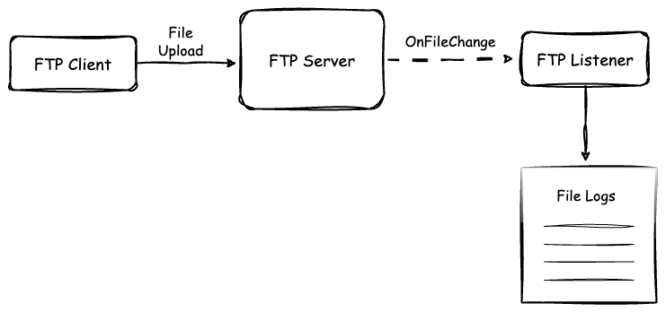

# [Ballerina] FTP Server Integration

This sample demonstrates how to initialize an FTP client and upload files to the FTP server while retrieving those files from an FTP service.



## Prerequisites

- Ballerina Swan Lake Update 8+

## Deploying the system

### 1. Setup a FTP Server

Run the following docker command to start an FTP server.

```sh
    docker compose up
```

### 2. Run the FTP client

Navigate to the client directory and run the Ballerina project.

```ballerina
cd client
bal run
```

### 3. Run the FTP listener service

Navigate to the service directory and run the Ballerina project.

```ballerina
cd service
bal run
```
