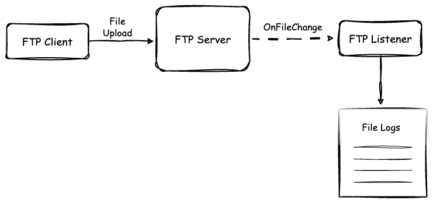

# [Ballerina] FTP Client and Service

This sample demonstrates how to initialize an FTP client and upload files to the FTP server while retrieving those files from an FTP service.



## Prerequisites

- Ballerina Swan Lake Update 8+

## Deploying the system

### 1. Setup a SFTP Server

Run the `docker compose` to set up the required dependencies.

```sh
    docker compose up
```

### 2. Run the FTP client

Execute the following command in the project directory.

```ballerina
bal run ftp-client-send.bal
```

### 3. Run the FTP listener service

Execute the following command in the project directory.

```ballerina
bal run ftp-service-send.bal
```
