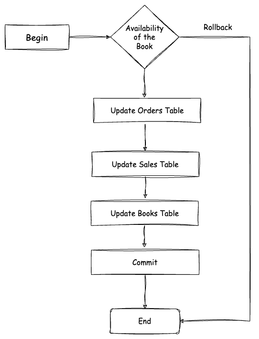

# [Ballerina] MySQL Database Integration

## Prerequisites

- Ballerina Swan Lake Update 8+

## Use Case 2: Database with Atomic Transactions

This implementation accesses a MySQL database with credentials and provides an atomic transaction for completing an order. First, it checks whether the amount of books are available in the inventory for the order to be completed and proceeds with the next steps. If any steps returns an error, the whole process will be rolled back to the initial state.



**Check Book Availability:** Check if the book is in stock by selecting the quantity from the books table. If the book is not available (quantity < 1), the transaction is rolled back, and an error message is printed.

**Update Book Inventory:** If the book is available, the quantity is reduced by one.

**Create Order Record:** A new record is inserted into the orders table with the purchase details.

**Update Sales Table:** A new record is inserted into the sales table to track the sale details.

**Rollback:** If any of the steps returns an error, the whole transaction will be rolled back to the initial state.

**Commit Transaction:** If all steps succeed, the transaction is committed, finalizing the changes.

## Deploying the system

### 1. Setup a MySQL Database

Run the `docker compose` to set up the required dependencies.

```sh
    docker compose up
```

### 2. Run the Ballerina project with transactions

Execute the following command in the project directory.

```ballerina
bal run transaction.bal
```
