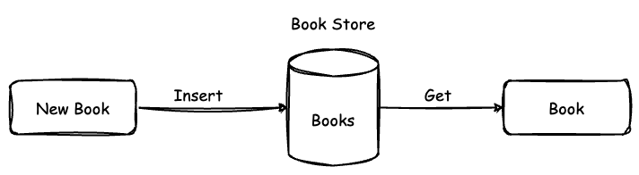
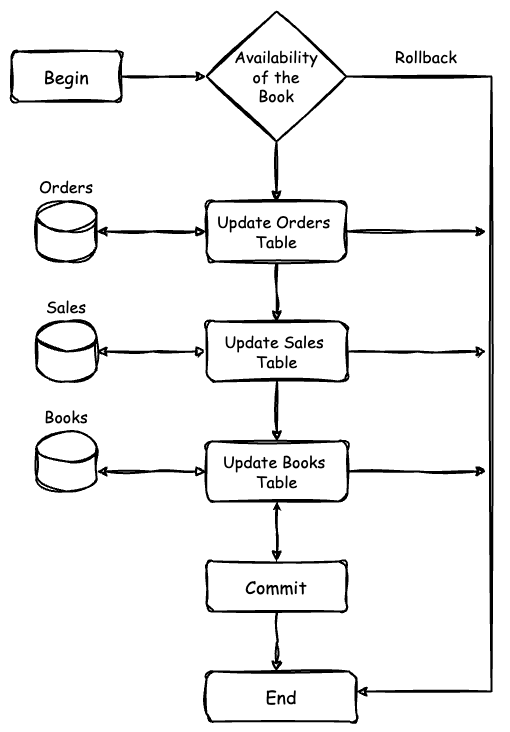

# [Ballerina] Oracle Database Integration

## Prerequisites

- Ballerina Swan Lake Update 8+

## Use Case 1: Basic Database Access

This implementation accesses a Oracle database with credentials inserts a new record into a table and then retrieves it.



## Deploying the system

### 1. Setup a Oracle Database

Run the following commands to set up the Oracle database server.

```sh
    colima start --memory 4 --arch x86_64   
    docker compose up
```

### 2. Run the Ballerina project

Navigate to the db-integration directory and run the Ballerina project.

```ballerina
cd db-integration
bal run
```

## Use Case 2: Database with Atomic Transactions

This implementation accesses a Oracle database with credentials and provides an atomic transaction for completing an order. Here, first, it checks whether the amount of books are available in the inventory for the order to be completed.



**Check Book Availability:** Check if the book is in stock by selecting the quantity from the books table. If the book is not available (quantity < 1), the transaction is rolled back, and an error message is printed.

**Update Book Inventory:** If the book is available, the quantity is reduced by one.

**Create Order Record:** A new record is inserted into the orders table with the purchase details.

**Update Sales Table:** A new record is inserted into the sales table to track the sale details.

**Rollback:** If any of the steps returns an error, the whole transaction will be rolled back to the initial state.

**Commit Transaction:** If all steps succeed, the transaction is committed, finalizing the changes.

## Deploying the system

### 1. Setup a Oracle Database

Run the `docker compose` to set up the required dependencies.

```sh
    docker compose up
```

### 2. Run the Ballerina project with transactions

Execute the following command in the project directory.

```ballerina
cd db-transaction
bal run
```

## Use Case 3: Database with Transaction Rollbacks

This sample is to demonstrate how the database transactions are rolled back whenever an error is encountered during the process.

Execute the following command in the project directory.

```ballerina
cd db-transaction-rollback
bal run
```
