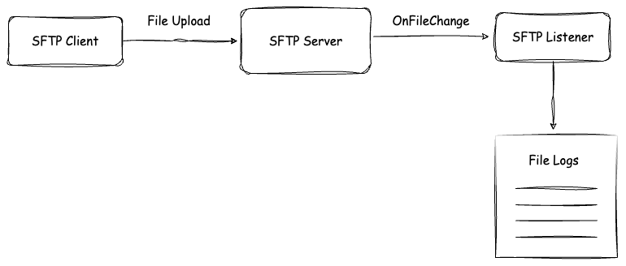

# [Ballerina] SFTP Server Integration

This sample demonstrates how to initialize an SFTP client and upload files to the SFTP server while retrieving those files from an SFTP service.



## Prerequisites

- Ballerina Swan Lake Update 8+

## Deploying the system

### 1. Setup a SFTP Server

Run the following docker command to start an SFTP server.

```sh
    docker compose up
```

### 2. Run the SFTP client

Navigate to the client directory and run the Ballerina project.

```ballerina
cd client
bal run
```

### 3. Run the SFTP listener service

Navigate to the service directory and run the Ballerina project.

```ballerina
cd service
bal run
```
