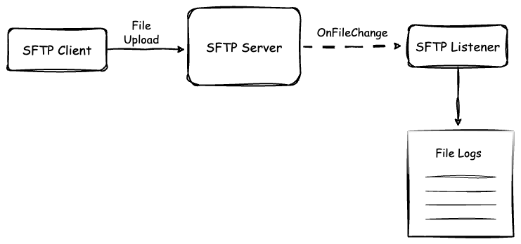

# [Ballerina] SFTP Client and Service

This sample demonstrates how to initialize an FTP client and upload files to the FTP server while retrieving those files from an FTP service.



## Prerequisites

- Ballerina Swan Lake Update 8+

## Deploying the system

### 1. Setup a SFTP Server

Run the `docker-compose` command to set up the required dependencies.

```sh
    docker compose up
```

### 2. Run the SFTP client

Execute the following command in the project directory.

```ballerina
bal run sftp-client-send.bal
```

### 3. Run the SFTP listener service

Execute the following command in the project directory.

```ballerina
bal run sftp-service-send.bal
```
